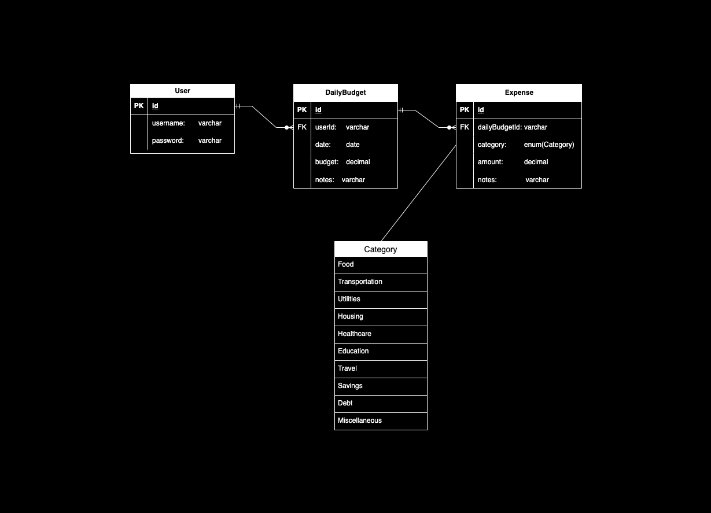

# Daily Budget Web App

## Getting Started (FE)

### Install the packages being used in the web directory
```
cd web
npm i
```

### Command to run web

```bash
npm run dev
# or
yarn dev
# or
pnpm dev
# or
bun dev
```

Open [http://localhost:3000](http://localhost:3000) with your browser to see the result.

## Getting Started (BE)

### Environment Variables
```
DATABASE_URL=""
PORT=
ACCESS_TOKEN_SECRET=
```

### Run below commands
- To install packages
```
cd server
npm i
```

- Run migrations
```
npx prisma migrate dev
```

### Command to run server

```bash
npm run dev
# or
yarn dev
# or
pnpm dev
# or
bun dev
```

### Features
- Sign Up
  - Register and create an account to start using the daily budget management app.

- Sign In
  - Log in with your credentials to access your personalized daily budget dashboard.

- Add Daily Budget
  - Create daily budgets to set spending limits and track your financial goals.

- View Daily Budget Details
  - Explore detailed information about your daily budgets, including allocated budget and remaining balance.

- Add Expenses to the Daily Budget
  - Log your daily expenses and categorize them within your budget to monitor spending.

- Print Daily Budget Details with Expenses
  - Generate a printable version of your daily budget details, including a list of expenses.

### ERD
> 

